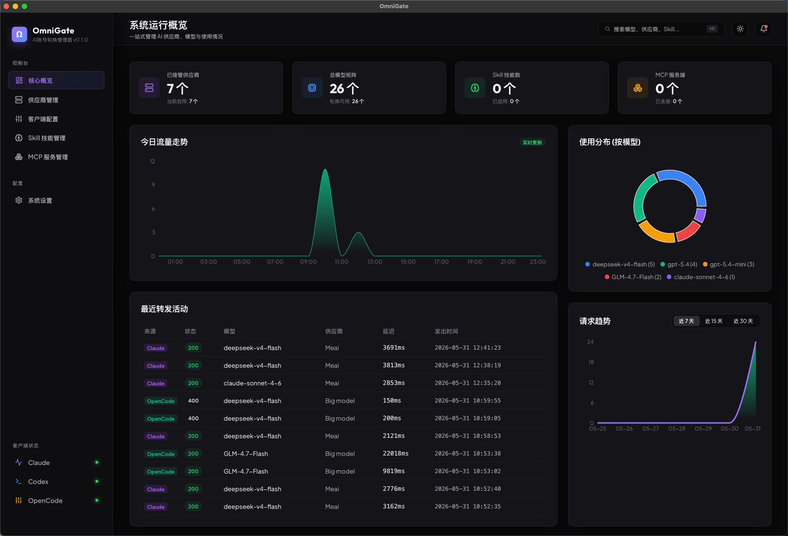
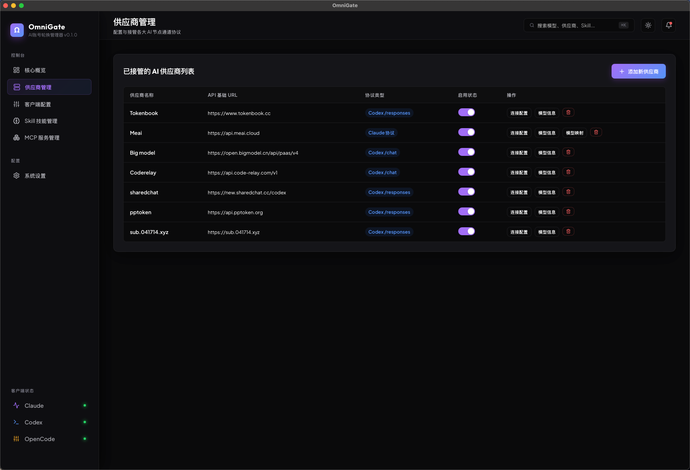
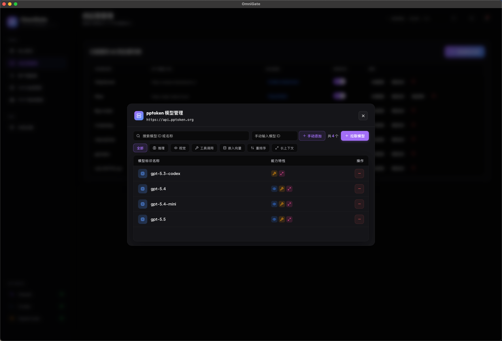
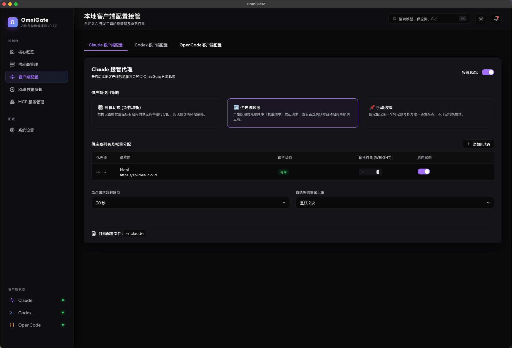
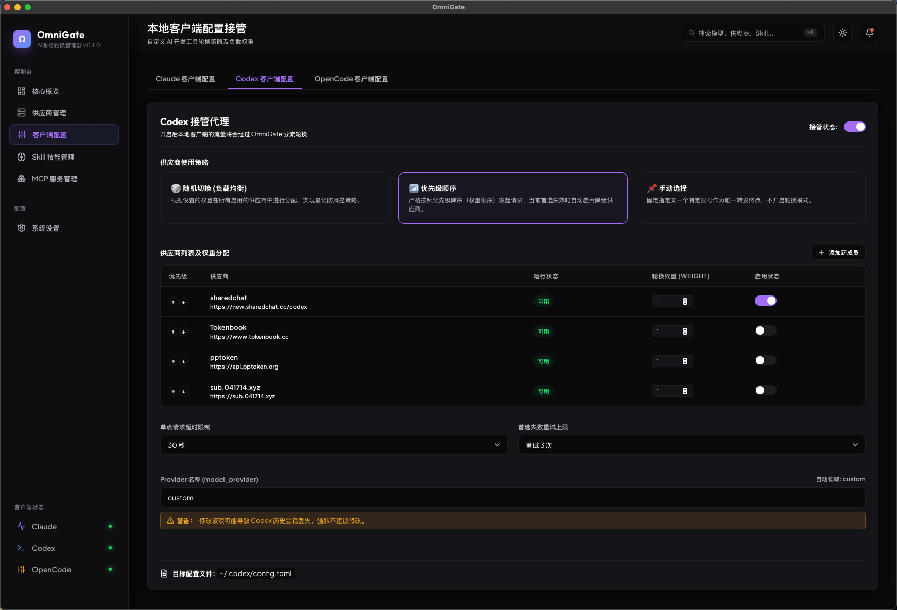
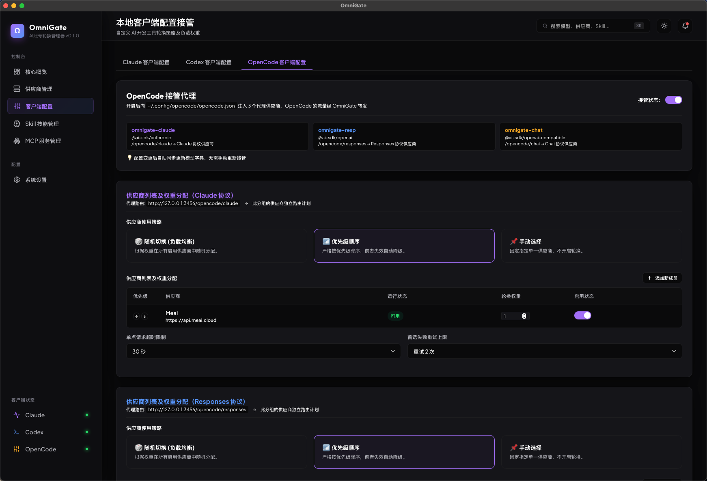

# OmniGate 🌌

OmniGate 是一个专为 AI 极客与开发者打造的 **统一 AI 模型代理与路由网关**。它能够完美接管你所有的 AI 供应商账号，并在本地提供无缝、统一的协议转换和对外服务接口。

无论你是通过各种第三方客户端，还是 IDE 插件（如 Cursor、Cline）调用 AI 服务，OmniGate 都能为你省去在不同客户端反复配置 API 密钥的繁琐步骤。

## ✨ 核心优势

### 1. ⚡️ 一次配置，全端复用 (Configure Once, Run Everywhere)
过去，每次在不同的桌面客户端或 IDE 中增加一个模型，你都需要不厌其烦地重新配置一遍 API URL 和 Key。
现在，**只需在 OmniGate 中配置一次您的供应商池**。OmniGate 会在本地自动启动服务并接管所有主流协议，**Claude、Codex、OpenCode 等客户端均可直接无缝指向本地网关**，实现真正的一次配置，全端随意调用。

### 2. 🔄 账号自动轮换与容灾管理
你是否拥有多个供应商（如各个中转站、官方账号）的 API Key？
OmniGate 原生内置了极其强大的路由引擎与自动轮换策略：
* **自动容灾轮换**：当某个供应商的 API 发生宕机、限流、欠费或返回 502/504 等异常时，OmniGate 能够自动、无感地为你切换至下一个备用供应商，客户端完全不会收到报错中断。
* **全局默认模型兜底**：通过独创的模型别名映射与默认接管机制，你可以将冷门模型或者无法匹配的调用一键强制路由至你指定的主力模型上，彻底告别 “模型未找到” 的报错。

### 3. 📊 极致的可视化数据看板
内置现代化极简深色后台，你的每一笔请求耗时、状态码、Token 消耗均有详细记录。通过全景的 24 小时动态趋势面积图和各类雷达指标，为你提供极强的流量掌控感。

## 📸 界面预览

### 供应商与模型管理
极简的供应商池配置，你可以在这里无缝开启各个通道，以及快速配置上游支持的模型：

### 丰富的客户端配置
无论什么工具，都能被 OmniGate 完美接管并映射。
#### Claude 协议接管

#### Codex / Copilot 协议接管

#### OpenCode 协议接管

---

## 🚀 下一阶段开发计划

为了让 OmniGate 成为真正无所不能的 AI 极客中枢，我们正在规划以下重磅功能：
* **统一的系统提示词 (System Prompt) 注入管理**：支持对 Claude、Codex、OpenCode 等不同通道独立配置和动态注入 System Prompt。
* **Skill 与 MCP (Model Context Protocol) 统一管理**：集中化管理所有的底层能力集（Skills）与本地环境交互协议（MCP），一键赋能大模型更强的工具调用与系统自动化能力。

---

## 📞 联系交流

如果你对本项目感兴趣，或者在使用中遇到了任何问题、需要反馈建议，欢迎通过微信与我交流探讨！

