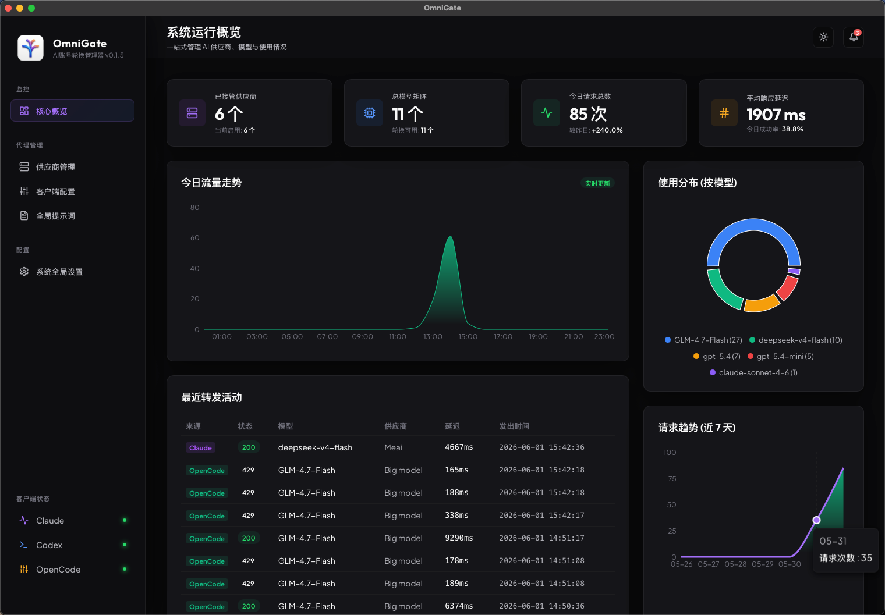
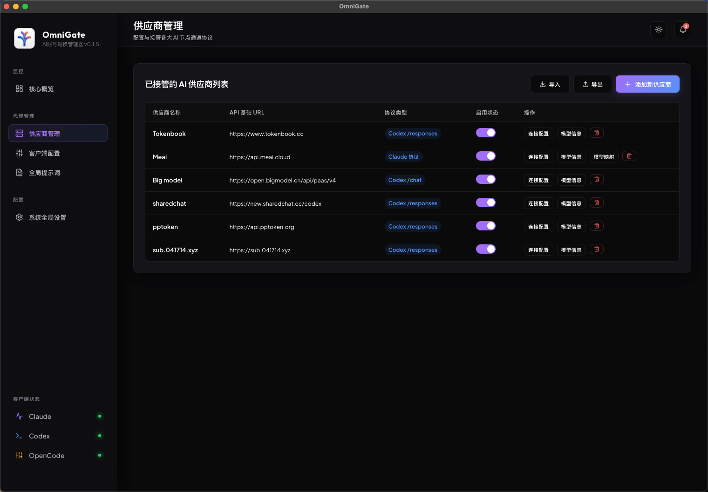
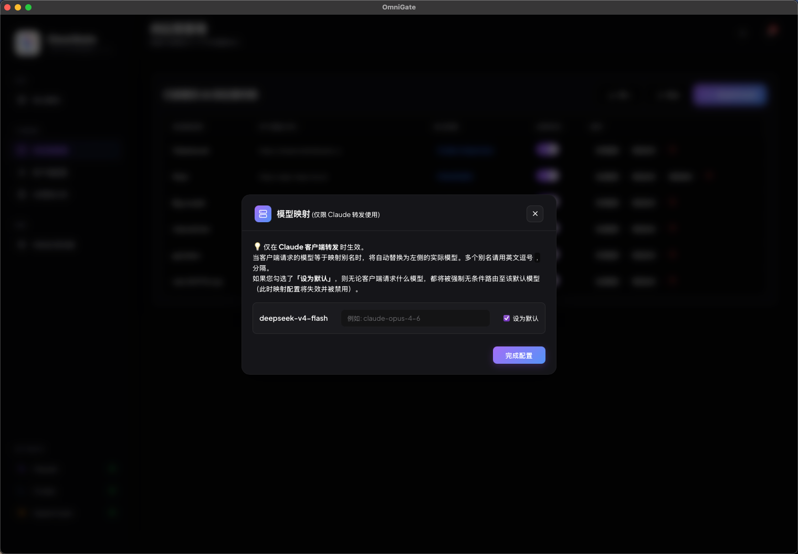
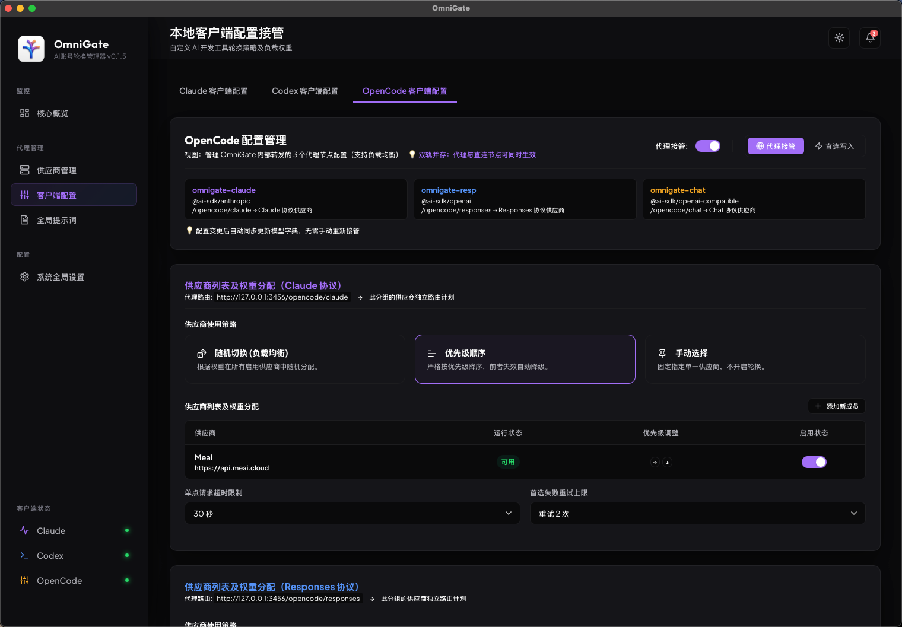
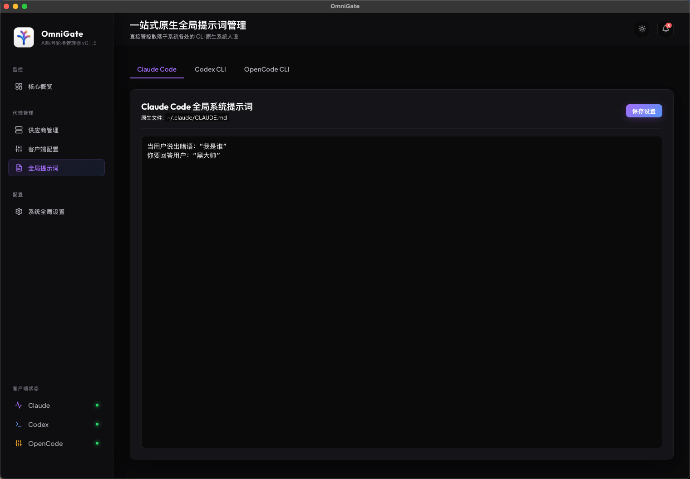
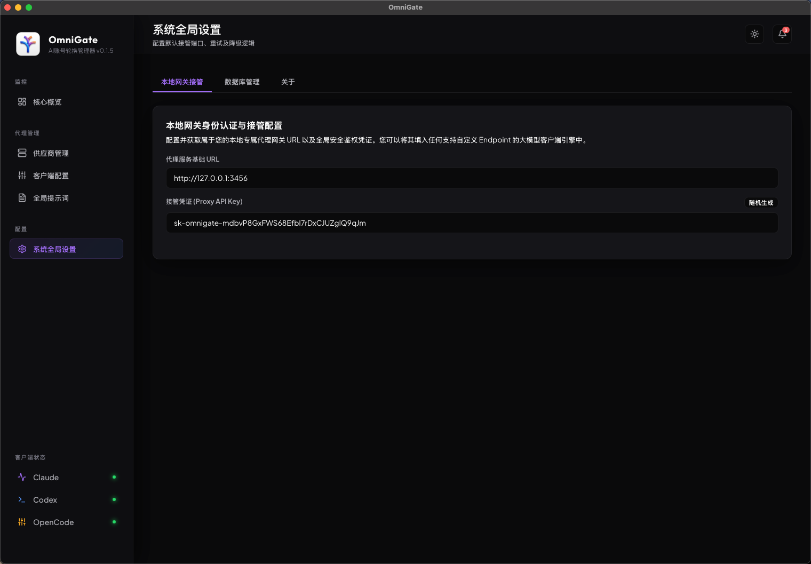

  

# 🌌 OmniGate (万能之门)

  <strong>💡 不是做又一个，而是做更易用的一个！</strong> 
  <em>开发者专属的 AI 网关控制面板 —— 彻底终结多客户端密钥配置混乱与接口抖动</em>

  
  
  

  <strong>🔗 官方展示主页：<a href="https://leviathangk.github.io/OmniGate" target="_blank">leviathangk.github.io/OmniGate</a></strong>

---

## 📢 最新更新 (v0.2.2)

* **原生配置安全直写与拦截保护**：新增独立配置文件管理页面，无需手动寻找本地文件，直接在界面安全编辑并写入原生终端。采用强大的**跨标签页未保存拦截器**，全方位保护你的每一处细微修改，避免数据丢失。
* **原生防风控重试（Exponential Backoff）**：内置针对 429 (Rate Limit) 与 502 等上游大模型临时错误的**指数级退避重试**机制。失败不报错，而是默默等待并重新突围，保障高并发开发流的稳定性。
* **200 伪装拦截器**：有些中转服务商拦截请求后仍会下发 `200 OK` 状态码，现已支持自定义“流片段匹配词”，只要命中即刻判断为失败，立刻熔断并切换至下一个备用节点。
* **UI 工业级焕新**：全面革新弹窗与组件的设计语言，重写所有生硬的边框与对齐，带来如同顶级商业软件般柔顺高雅的视觉与交互体验。

---

## 🌟 核心理念

在 AI 辅助编程爆发的时代，开发者面临越来越庞杂的模型渠道。频繁在终端工具（如 Claude CLI、Codex CLI 等）中切换密钥、配置网络、修补断点，不仅打破了心流，更是一种无谓的内耗。

**OmniGate 并不想成为“又一个”生硬的脚本工具，我们追求极致易用、坚如磐石的开发者控制面板。**
一处配置，处处使用。兼具 **Rust 的强悍性能** 与 **Tauri 的轻量优雅**。

---

## ⚡ 九大核心特性

### 01 / 统一供应商纳管与模型云端一键拉取
集中化纳管你的所有 API 渠道，支持一键从上游云端直接拉取最新可用的模型列表，告别查文档、手工输入的刀耕火种时代。

### 02 / 双模式运行：想怎么用，随你便
- **直连模式 (Direct)**：将供应商原始信息“原封不动”直写到客户端配置中。网关零介入，享受极致的原生性能与零延迟。
- **接管模式 (Proxy)**：将配置指向 OmniGate 本地网关。让所有的 API 请求流经本地网关，享受路由调度、断路保护与流量观测。

### 03 / 多级接管调度机制
根据场景自由选择你的调度策略：
- **指定顺序（用废自切）**：依序访问。某个节点遭遇错误熔断后，自动毫秒级切换到下一顺位，保证开发心流不断档。
- **手动锁定**：将流量死锁在某一固定渠道。
- **随机分发**：在所有存活节点中随机抽签分配流量（注意：随机分发可能会降低长对话的 Context 缓存命中率）。

### 04 / Claude 模型别名与默认映射
无需在客户端中反复修改传入的模型名称（如 `claude-3-5-sonnet-20241022`）。在网关处配置逗号分隔符，自由映射到你中转渠道的实际别名，或直接设置“全局缺省模型”，强制收拢所有未匹配请求。

### 05 / 预设全局 Prompt 管理
通过 UI 集中管理全局 `System Prompt` 预设，动态开启后，将无感地自动注入到所有的本地网关对话流中。一处设定，所有客户端同时拥有专属业务背景对齐。

### 06 / 工业级熔断降级与秒级自愈
- **降级惩罚**：某节点发生轮次失败后，顺位立即延后 1000 位（顺序模式），或遭遇权重指数衰减（随机模式），主动让路。
- **一击必愈 (Self-Healing)**：惩罚状态中的节点，只要在后续尝试中成功响应 1 次，立马洗刷所有“负面评分”，满血复活。
- **大家平权机制**：若所有节点均跌入惩罚名单，网关立刻重置惩罚队列，防范全网死锁。

### 07 / 防风控重试与 200 伪装识别
- **指数退避重试**：完美应对上游 429 频控封锁，网关自动按照 `2s, 4s, 8s` 的规律发起指数退避等待，直至到达全局设置的最大阈值。
- **伪装匹配**：面对不良中转商恶意返回 `HTTP 200` 却内含错误流的恶劣情况，设定关键词拦截后，网关会将其一脚踢出，强行触发熔断。

### 08 / 多端终端配置直写保护
内置安全配置编辑器。无论是更新 Codex 的 `config.toml` 还是 Opencode 的 `opencode.json`，都可以直接在 GUI 界面完成修改写入。不仅能校验当前环境，更有未保存跨栏拦截，保障你的配置零丢失。

### 09 / 零磁耗：本地高并发 SQLite 事务
全盘抛弃容易发生层级错乱和语法故障的 YAML 配置。所有状态管理与数据持久化采用高安全性捆绑 SQLite 存储，通过 `RwLock<HashMap>` 实现内存态并发，杜绝频繁磁盘 IO。

---

## 🛠️ 技术底座与性能优势

- **Rust + Tauri**：借助 Rust 极致的内存安全性，提供原生多路复用的超轻量级桌面控制面板，极低内存占用。
- **Axum + Reqwest**：底层网络转发引擎采用 Axum 路由分发，结合 Reqwest 的连接池复用技术，**代理延迟稳定 < 1ms**。
- **本地闭环保护**：纯离线运行，所有的 API Key 与交互逻辑严格留存在您的个人设备内。

---

## 📸 运行掠影

  <table width="100%">
    <tr>
      <td width="50%" align="center">
        <strong>仪表盘：流量概览与接口延迟观测</strong> 
        
      </td>
      <td width="50%" align="center">
        <strong>供应商防风控：一键云端模型拉取</strong> 
        
      </td>
    </tr>
    <tr>
      <td width="50%" align="center">
        <strong>灵活模型映射配置</strong> 
        
      </td>
      <td width="50%" align="center">
        <strong>终端接管与安全直写机制</strong> 
        
      </td>
    </tr>
    <tr>
      <td width="50%" align="center">
        <strong>全局级预设 Prompt 编辑器</strong> 
        
      </td>
      <td width="50%" align="center">
        <strong>深度底层参数配置与退避策略</strong> 
        
      </td>
    </tr>
  </table>

---

## 💬 社区、交流与赞助

如果 OmniGate 终结了你配置密钥的烦恼，让你的开发流再次顺滑，欢迎赞助 3 元请作者喝瓶可乐 🥤，您的每一份支持都是持续进化的燃料！

如果您在使用过程中有任何反馈或改进建议，欢迎加入开发者微信群一同探讨。

  <table width="100%">
    <tr>
      <td width="33%" align="center">
        <strong>💬 交流探讨群</strong> 
         
        
      </td>
      <td width="33%" align="center">
        <strong>👤 微信联络（反馈建议）</strong> 
         
        
      </td>
      <td width="34%" align="center">
        <strong>🥤 赞助支持（打赏可乐）</strong> 
         
        
      </td>
    </tr>
  </table>

---

  <strong>© 2026 OmniGate · Made with ❤️ by Leviathangk & DeepMind Pair Programming</strong>

