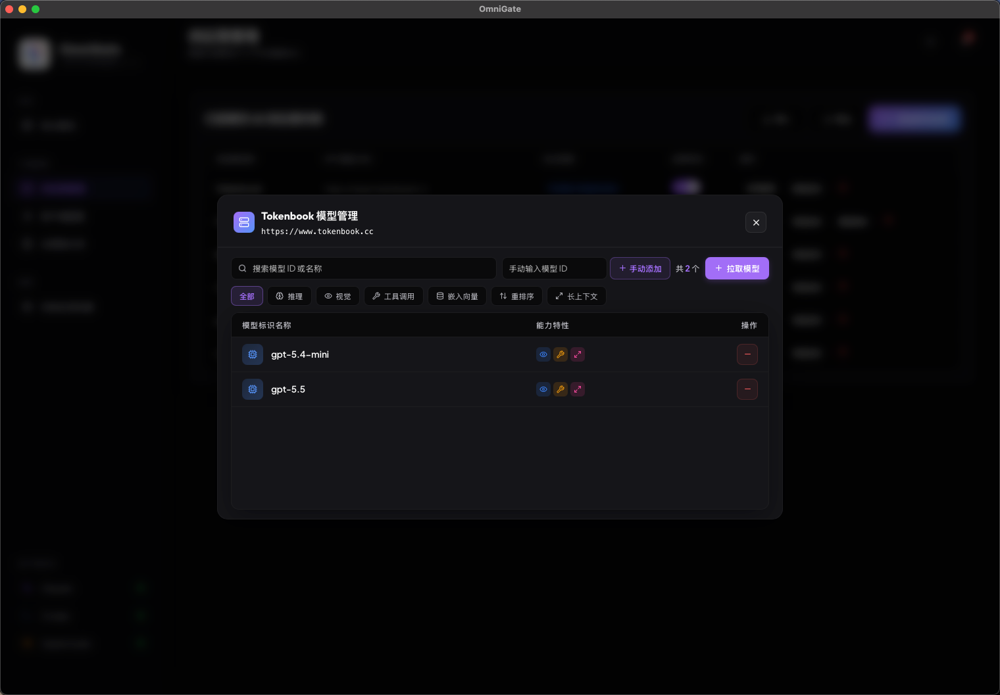
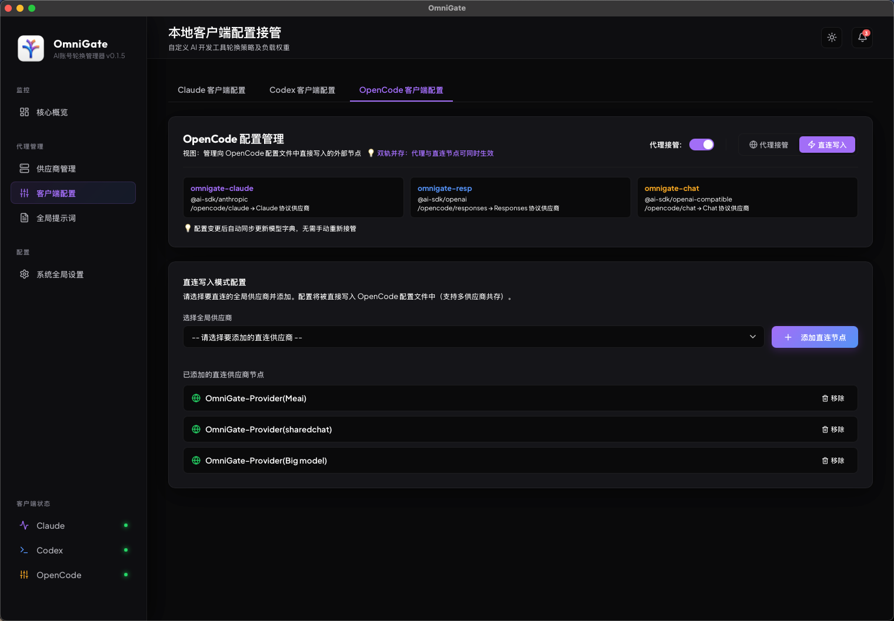

  

# 🌌 OmniGate (万能之门)

  <strong>💡 不是做又一个，而是做更易用的一个！</strong>

  
  
  

---

## 🌟 项目愿景

在 AI 辅助编程爆发的时代，我们拥有了越来越多的大模型服务商（OpenAI, Anthropic, DeepSeek, Google, 以及各种中转 API）。然而，当我们在日常开发中使用各种开发辅助 Cli 工具（如 **Claude Cli**、**Codex Cli**、**Opencode Cli**）时，频繁地在各个配置文件中切换密钥、配置代理、管理模型映射是一件极度琐碎且令人沮丧的事情。

**OmniGate** 的诞生不是为了“又造一个轮子”，而是为了**“做一个真正好用、极致易用、坚如磐石的开发者网关控制面板”**。

一处配置，处处使用。无论是直连还是多节点动态调度，OmniGate 都以优雅的 GUI 交互和强悍的 Rust 底层，为您彻底终结 AI 服务管理混乱的痛点。

---

## ⚡ 核心特性

### 1. 🎛️ 统一的供应商管理面板
* **一处配置，处处使用**：集中管理您所有的 API Key 和接口地址。
* **模型一键拉取**：一键从云端拉取供应商支持的所有模型列表，无需手动查找与输入。
* 支持主流协议标准，让多账号、多渠道的管理变得轻而易举。

### 2. 🔀 接管模式 vs 直连模式 —— 想怎么用，随你便
根据开发者的实际使用场景，OmniGate 独创了双模式配置写入机制：

* **🔌 直连模式**：
  直接将选定供应商的**原始连接信息与 API Key** 写入 Cli 配置文件中。OmniGate 作为静态配置生成器，在写入后不参与任何流量转发，实现完全零延迟的直接通信。
* **🛡️ 接管模式**：
  将 **OmniGate 的本控网关连接信息** 写入对应的 Cli 配置文件中，所有请求通过本地运行的 OmniGate 代理网关进行智能化转发与多路调度。

### 3. 🧠 智脑路由与多级接管策略
当处于**接管模式**时，OmniGate 底层的 Rust 负载均衡引擎提供了三种顶级的调度策略：
* **指定顺序（默认 🌟）**：按照您拖拽/指定的顺序，一个供应商“用废”后自动无缝切换到下一个，保障开发流的极致连续性。
* **手动选择**：固定绑定指定的某一个供应商一直使用，不进行任何动态切换。
* **随机切换（不推荐）**：在可用供应商间随机分发流量（注意：随机切换会降低上游服务商的 Context 缓存可用性，请谨慎选择）。

### 4. 🔀 Claude 自由映射与默认全局映射
针对 Claude 协议的特殊性，OmniGate 提供了强大的模型别名映射能力：
* **全局默认映射**：指定某个模型作为缺省接管模型，无视请求侧传入的具体模型名，强制交由全局默认模型接管。
* **自由别名映射**：通过简单地逗号分隔，轻松将客户端请求的任意模型名（如 `claude-3-5-sonnet`）映射到您中转渠道的实际模型名称（如 `custom-sonnet-v1`）。

### 5. 📝 全局提示词管理
* **一处搞定，多端共用**：集中化管理您的全局 System Prompt。
* 通过控制台统一调整或开启 Prompt，自动注入到经过 OmniGate 转发的每一次对话请求中，打造个性化的专属编程助手。

### 6. 🚀 工业级熔断器（Circuit Breaker）与动态降级策略
为了应对大模型 API 偶发的瞬时网络抖动或服务商封锁，OmniGate 在内存态中实现了一套高性能熔断降级系统：
* **连续异常降级**：当某个供应商在一轮重试（`retry_count + 1` 次）中全部失败，系统会在内存中对其施加惩罚：
  * *顺序模式*下：该节点的优先级排序临时向后延后 1000 位，迅速让路给备用节点。
  * *随机模式*下：该节点的流量权重减半（指数级衰减，直至保留最低权重 1），降低被选中的概率。
* **一击必愈（自愈）**：被惩罚的节点一旦在后续重试中**成功响应一次**，立刻秒级洗刷所有惩罚，满血复活！
* **大家平权机制**：若所有可用节点都意外处于惩罚状态，系统将自动清空所有惩罚记录，大家重回同一起跑线平权竞争，防止陷入死锁，同时规避了 SQLite 磁盘高频 IO 带来的开销。

---

## 📸 功能模块展示

### 🖥️ 核心状态概览
在主面板直观掌控网关运行状态、API 访问延迟和实时流量统计。

  

### 🗃️ 统一供应商管理与模型映射
一站式绑定供应商，支持一键模型自动拉取与 Claude 模型别名的自由映射。

  <table width="100%">
    <tr>
      <td width="50%" align="center">
        <strong>供应商管理主页</strong> 
        
      </td>
      <td width="50%" align="center">
        <strong>拉取模型展示</strong> 
        
      </td>
    </tr>
    <tr>
      <td colspan="2" align="center">
        <strong>Claude 模型映射配置</strong> 
        
      </td>
    </tr>
  </table>

### 🔌 客户端配置（以 OpenCode 为例）
支持三种模式与直连写入，一键即可将网关参数或直连信息持久化到对应的 Cli 配置文件中。

  <table width="100%">
    <tr>
      <td width="50%" align="center">
        <strong>接管模式策略配置</strong> 
        
      </td>
      <td width="50%" align="center">
        <strong>直连模式直接写入配置</strong> 
        
      </td>
    </tr>
  </table>

### 🎨 全局提示词与系统设置
极简而高雅的全局 Prompt 管理面板与端口热切换配置。

  <table width="100%">
    <tr>
      <td width="50%" align="center">
        <strong>全局 Prompt 配置</strong> 
        
      </td>
      <td width="50%" align="center">
        <strong>系统设置面板</strong> 
        
      </td>
    </tr>
  </table>

---

## 🛠️ 技术底座与架构优势

1. **Rust + Tauri**：借助 Rust 极致的内存安全性与高性能运行，提供原生多路复用的超轻量级本地代理。
2. **Axum + Reqwest**：底层网络转发引擎采用 Axum 进行路由，结合 Reqwest 的多路复用连接池，确保代理延迟控制在毫秒级别。
3. **零磁耗断路器**：依靠并发安全的内存态数据结构（`RwLock<HashMap>`）跟踪节点信誉分，杜绝频繁读写 SQLite 数据库导致的磁盘频繁唤醒与 IO 延迟。

---

## 💬 交流、赞助与支持

如果您在使用过程中有任何反馈、建议或疑问，欢迎加入我们的开发者微信群，或添加作者个人微信一同交流探讨！
如果 OmniGate 对您有所帮助，或者让您的开发流程变得更加丝滑，欢迎赞助 3 元请作者喝瓶可乐 🥤，您的支持是项目持续迭代的最大动力！

  <table width="100%">
    <tr>
      <td width="33%" align="center">
        <strong>💬 交流群（进群交流探讨）</strong> 
         
        
      </td>
      <td width="33%" align="center">
        <strong>👤 个人微信（反馈与建议）</strong> 
         
        
      </td>
      <td width="34%" align="center">
        <strong>🥤 赞助支持（请喝瓶可乐）</strong> 
         
        
      </td>
    </tr>
  </table>

---

  Made with ❤️ by OmniGate Dev Team

